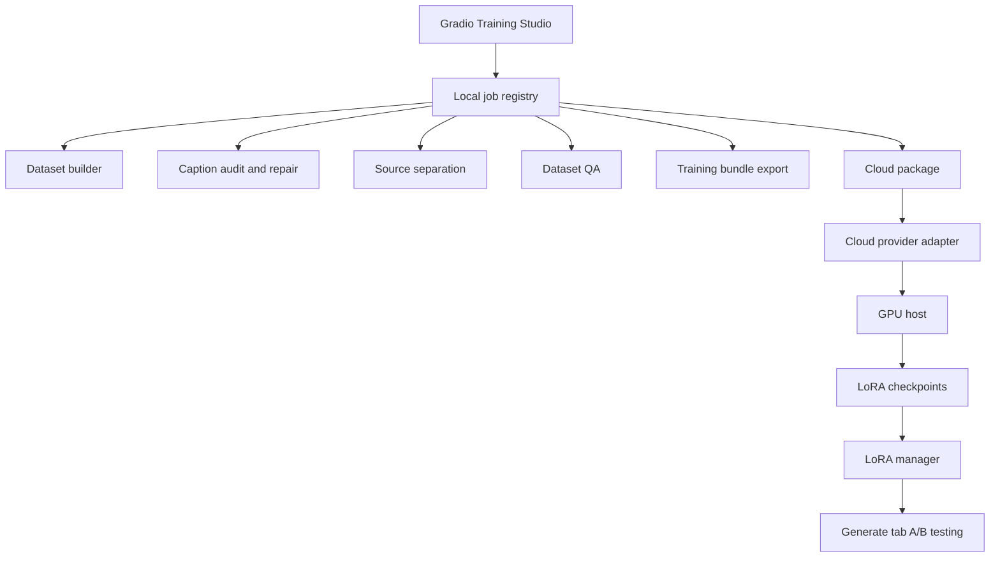

# Gradio Training Studio Plan

This plan captures the proposed Gradio workflow for dataset preparation,
source separation, cloud LoRA training, and adapter review.

The goal is to make Anvil's training tools usable without forcing every user
through the CLI, while keeping the CLI as the reliable engine underneath the
UI.

## Objective

Add a dedicated **Training Studio** tab to the Gradio app that can guide a user
through the full LoRA workflow:

```text
build dataset -> review captions -> separate stems -> run QA -> export bundle
-> package cloud job -> train -> collect adapters -> test in generation
```

The first useful version should focus on local dataset review and source
separation. Cloud launch controls should come later, after the job state layer
and safety rails are in place.

## Simplest Architecture

Use the existing CLI and Python modules as the source of truth. Gradio should
start jobs, poll job state, display logs, and link to generated files. It should
not reimplement dataset building, QA, source separation, cloud packaging, or
LoRA training logic.

```text
Gradio button -> local job registry -> existing Anvil command/module
             -> logs/artifacts/state -> Gradio poller
```

This gives the UI refresh tolerance, cancel buttons, history, and easier bug
reproduction because every UI action can map back to a CLI command.

## Component Flow



## Job State Layer

Before adding cloud buttons, add a small durable job layer under:

```text
~/.cache/anvil-audio/jobs/
```

Suggested layout:

```text
jobs/
  20260518-123000-dataset-qa/
    job.json
    stdout.log
    stderr.log
    artifacts.json
```

`job.json` should include:

- job id
- job type
- status: `queued`, `running`, `succeeded`, `failed`, `cancelled`
- created, started, and finished timestamps
- command preview or module operation name
- working directory
- exit code
- user-facing summary

`artifacts.json` should include generated paths such as:

- dataset directory
- `caption_audit_report.json`
- `dataset_qa_report.md`
- `training_bundle.json`
- cloud job directory
- collected checkpoint directories

The first implementation can run local subprocess jobs. A later version can
promote selected operations to in-process calls when streaming progress is
cleaner that way.

## UI Sections

### Dataset Builder

Controls:

- source type: local folder or YouTube URL
- dataset name
- output directory
- track count, clip count, and clip length
- style hint
- caption mode: `heuristic` or `llm`
- vocal transcription toggles

Outputs:

- live log panel
- dataset directory
- `character_sheet.json`
- `captions.json`
- next-step buttons for QA and separation

### Dataset Review

Controls:

- dataset directory
- run QA
- run caption audit
- dry-run repair
- write repair
- open report paths

Display:

- caption duplicate count
- low-confidence count
- cluster summary
- dominant tags
- warnings
- small clip table with caption, confidence, source, stems, and audio preview

### Source Separation

Controls:

- dataset directory
- backend
- mode: `instrumental`, `four-stem`, `vocals`
- limit for smoke tests
- force recompute

Display:

- separated count
- cached count
- failures
- stem file links
- stem audio preview when available

### Cloud Training

This should not ship before the job state layer is solid.

Controls:

- training bundle
- provider: RunPod first
- GPU search filters
- dry-run launch preview
- package job
- launch
- status
- collect
- terminate

Display:

- provider, pod id, host, port
- visible hourly cost
- elapsed time and estimated spend
- SSH target
- remote training log
- checkpoint list
- clear terminate button

Cloud launch should default to dry-run. Real launch should require an explicit
confirmation because paid GPU time starts immediately.

### LoRA Manager

Controls:

- import local checkpoint
- select adapter
- adapter name
- compare base versus LoRA

Display:

- adapter registry entry
- checkpoint epoch and loss when known
- source dataset
- training recipe
- quick A/B generation links or copied settings

## Command Mapping

| UI action | Existing command |
| --- | --- |
| Build local dataset | `anvil dataset build-local` |
| Build YouTube dataset | `anvil dataset build-youtube` |
| Run QA | `anvil dataset qa` |
| Audit captions | `anvil dataset captions` |
| Repair captions | `anvil dataset captions --repair` |
| Separate stems | `anvil dataset separate` |
| Export training bundle | `anvil dataset export-training-bundle` |
| Search GPUs | `anvil cloud search` |
| Package cloud job | `anvil cloud package` |
| Launch RunPod pod | `anvil cloud runpod launch` |
| Run SSH job | `anvil cloud run-ssh` |
| Check RunPod status | `anvil cloud runpod status` |
| Terminate RunPod pod | `anvil cloud runpod terminate` |
| Import LoRA | `anvil lora import-local` |

## Implementation Slices

### Slice 1: Training Studio Shell

- Add the `Training Studio` tab.
- Add dataset directory picker/text input.
- Add report path display.
- Add placeholder panels for dataset, stems, cloud, and adapters.
- Keep all buttons disabled or read-only except report discovery.

### Slice 2: Local Job Registry

- Add job creation, polling, log tailing, and cancellation helpers.
- Store state under `~/.cache/anvil-audio/jobs/`.
- Add tests for state transitions and stale job recovery.

### Slice 3: Dataset Review UI

- Wire QA, caption audit, repair dry-run, and repair write.
- Display report summaries and report paths.
- Keep source audio preview limited and lazy.

### Slice 4: Source Separation UI

- Wire `anvil dataset separate`.
- Show progress, cached results, and failures.
- Add a small smoke-test path with `--limit`.

### Slice 5: Bundle and Package UI

- Wire `export-training-bundle`.
- Wire `cloud package`.
- Display copied assets, warnings, and generated scripts.

### Slice 6: Cloud Training UI

- Wire GPU search.
- Wire RunPod dry-run launch first.
- Add real launch only with confirmation and visible cost.
- Wire status, collect, and terminate.
- Detect stale running pods from saved job state.

### Slice 7: Adapter Review

- Wire import from collected checkpoint directories.
- Add base versus adapter test helpers.
- Add listening notes and preferred checkpoint markers.

## Hard-to-Reverse Decisions

The job state schema is the main contract to get right. Once users have job
history and artifacts on disk, changing that layout carelessly can make old
runs hard to inspect.

Provider credential handling is also important. The UI should read credentials
from environment variables or the existing provider mechanisms. It should not
save API keys into job state, logs, Markdown reports, or Gradio component
values.

Cloud lifecycle semantics need to be explicit. A launched pod should have a
saved provider, pod id, cost hint, and terminate command so the UI can recover
after refresh or restart.

## Security and Cost Guardrails

- Never store cloud API keys in job files.
- Redact secrets from command previews and logs.
- Default paid cloud operations to dry-run.
- Show estimated hourly cost and elapsed cost while a pod is running.
- Keep terminate controls visible wherever a running pod is shown.
- Warn when a running cloud job has no recent log or checkpoint activity.
- Record the exact command preview so users can reproduce or kill work from the
  terminal.

## Success Criteria

Training Studio v0 is useful when a user can:

- select an existing dataset
- run caption audit and QA
- separate stems with a small smoke limit
- export a training bundle
- see logs, summaries, warnings, and generated file paths without leaving
  Gradio

Training Studio v1 is useful when a user can:

- package a job
- dry-run a RunPod launch
- launch, monitor, collect, and terminate a cloud job
- import a collected LoRA checkpoint
- run a base versus adapter comparison from the Generate tab

## Open Questions

- Should job history be per-user global under `~/.cache/anvil-audio/jobs/`, or
  also mirrored into project output folders?
- Should long jobs be subprocess-only, or should local dataset tasks call Python
  modules directly for richer progress events?
- How much audio preview belongs in Gradio before the page gets too heavy?
- Should cloud launch require typing the provider name as confirmation, or is a
  checkbox plus visible cost enough?
- Should adapter A/B comparisons live inside Training Studio, Generate, or both?
